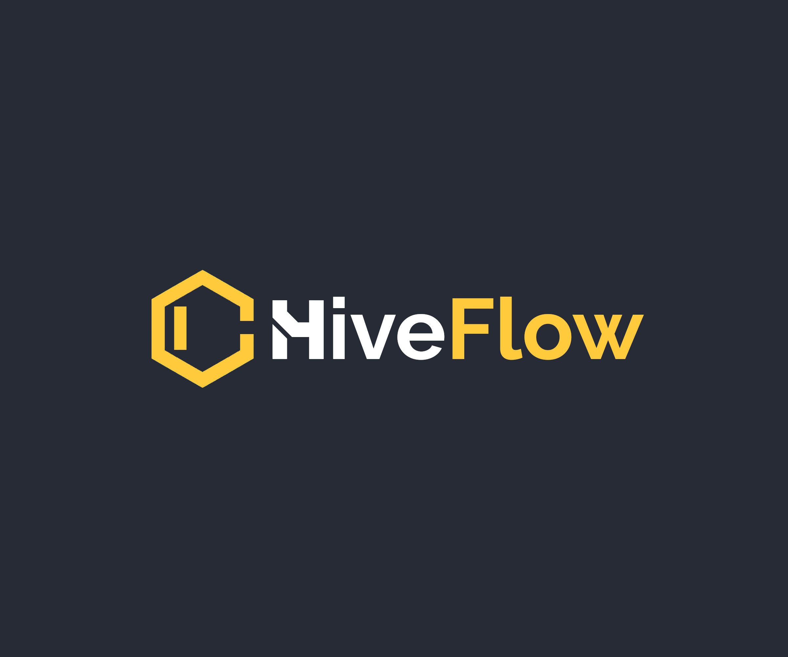

HiveFlow is an integrated home automation framework. It is built to be portable, modular and extensible. This facilitates the addition or removal of nodes from the hive as well as integrated data sharing and processing across nodes.